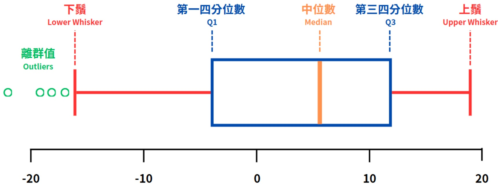

優勢：

適合處理含有離群值的資料。

◆ 能夠準確反映資料的集中分佈範圍。

● 侗限：

雖然可以過濾極端值，但不提供資料分佈的具體細節。

### C. 箱形圖（Box Plot）

意義：

又稱為盒鬚圖、盒狀圖，用來可視化資料集中趨勢與離散程度的工具，尤其在資料探索階段（Exploratory Data Analysis, EDA）中非常有用。

組成：

中位數（Median）：

箱形圖中的水平線，將資料分成兩個等份。這是資料的第二四分位數（Q2），也就是中位數。它表示數據集的中間位置，50%的數據位於其上方，50%位於其下方。

第一四分位數（Q1）和第三四分位數（Q3）：

Q1（第一四分位數）：盒子的下邊界，代表資料中最小的25%的數據。

Q3（第三四分位數）：盒子的上邊界，代表資料中最上層的25%的數據。