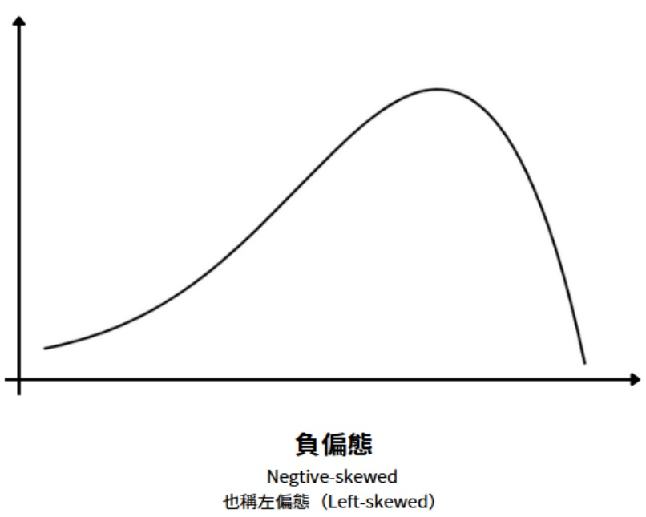
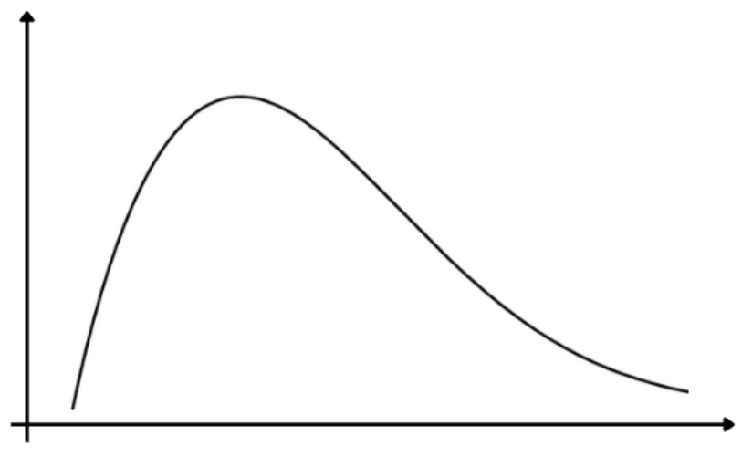

正偏態 Positive-skewed 也稱右偏態（Right-skewed）

正偏態（Positive-skewed）：

也稱為右偏態（Right-skewed），偏度大於0。

◆ 右側的尾部更長，分佈的主體集中在左側。

常見於收入、房價或故障時間等分佈，右側極端值（如高收入者）拉高平均值。例如，某城市房價資料偏度為2.5，顯示少數豪宅價格顯著影響整體分佈。

負偏態（Negative-skewed）：

也稱為左偏態（Left-skewed），偏度小於0。

左側的尾部更長，分佈的主體集中在右側。

常見於集中高值但少數低值的情況。例如，某設備壽命資料偏度為-1.8，原因為設備部屬早期時出現故障、因此有少數資料拉低平均值。

偏度接近0：

分佈趨近對稱，類似理想常態分佈。

例如某工廠產品重量資料偏度為 0.1，顯示分佈均衡。

## （2） 峰度（Kurtosis）

峰度（Kurtosis）也稱為尖度，在統計學中衡量實數隨機變數機率分佈的峰態。峰度用於衡量資料分佈「尾部與峰頂的尖銳程度」，亦即某分佈是否「高峰重尾」或「扁平輕尾」。根據不同的統計學家，峰度的定義有所不同。以下以常在統計學理論中使用之：