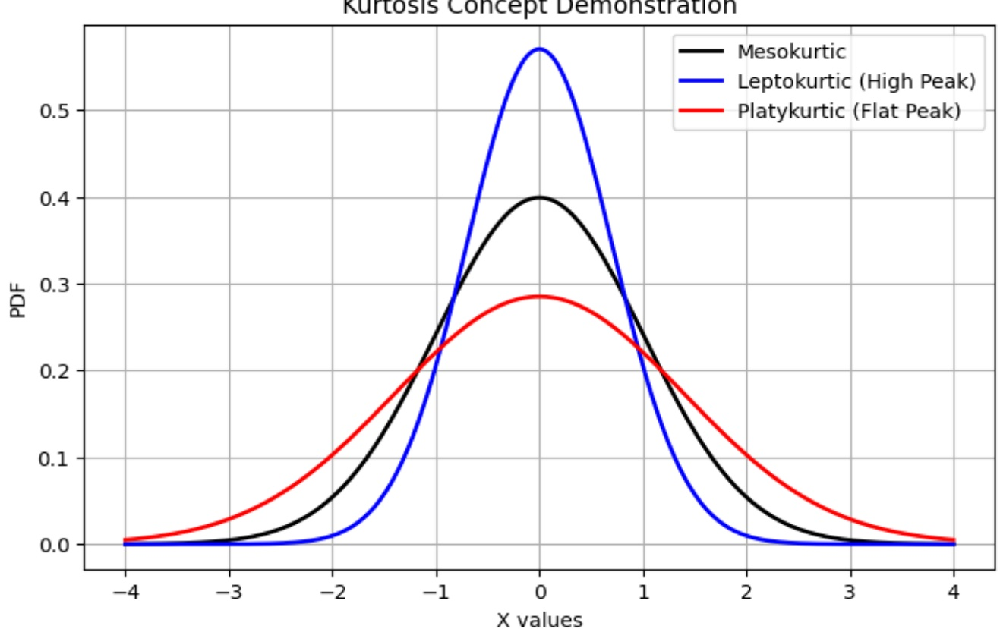

「Pearson 定義、常態峰度標準 3」作為說明。

## 高峰（Leptokurtic）

◆ Kurtosis > 3

當峰度大於3時，稱為高峰分佈（Leptokurtic）。

這意味著該分佈比常態分佈更加集中於中心，並且有更多的極端值（outliers），即數據中較大（或較小）的值出現機率比常態分佈高。

需要特別留意這類分佈在模型外推或異常檢測中的風險，因為極端值的存在可能會影響模型的預測結果，尤其是在處理預測或迴歸問題時。

## 中峰（Mesokurtic）

◆ Kurtosis  $ \approx 3 $

當峰度接近3時，稱為中峰分佈（Mesokurtic）。這個分佈通常接近於常態分佈，既不過於尖銳，也不過於扁平。它可以被視為標準的常態分佈，適合作為比較其他類型分佈的參照。

## • 扁平（Platykurtic）

◆ Kurtosis < 3

當峰度小於3時，稱為扁平分佈（Platykurtic）。這意味著資料的分佈較為分散，並且比常態分佈更平坦，沒有太多極端值。