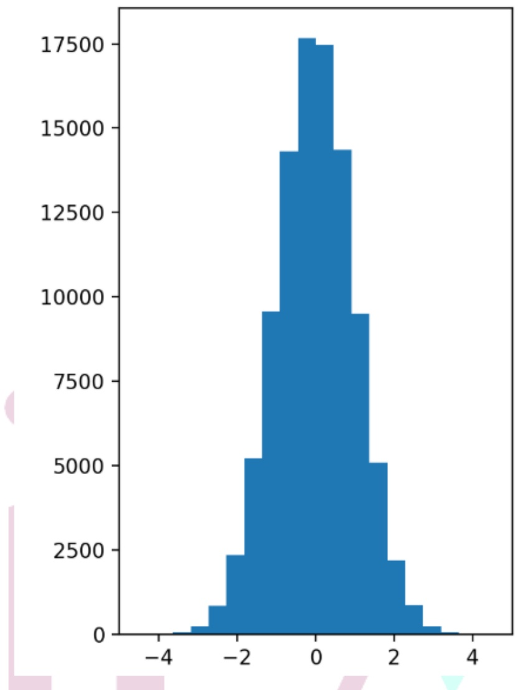
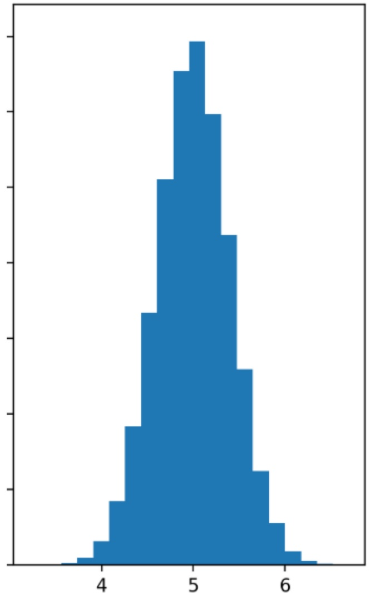

## （1） 數值型資料的分佈與集中趨勢呈現

數值型資料的視覺化專注於展示數據的整體分佈、集中趨勢、偏態性和異常值，幫助分析者理解數據結構並識別潛在問題。

• 直方圖（Histogram）

原理：將連續數值資料分為多個區間（bins），以柱狀高度表示每個區間的頻次，展示分佈形狀（如常態、偏態）。

適用情境：觀察資料的集中區段、偏態性或異常值，例如顧客消費金額、網站停留時間。

優勢：直觀展示分佈特性，易於識別異常值或多峰分佈。

缺點：區間數量（bins）選擇影響結果，過多或過少可能掩蓋模式；不適合少量數據。