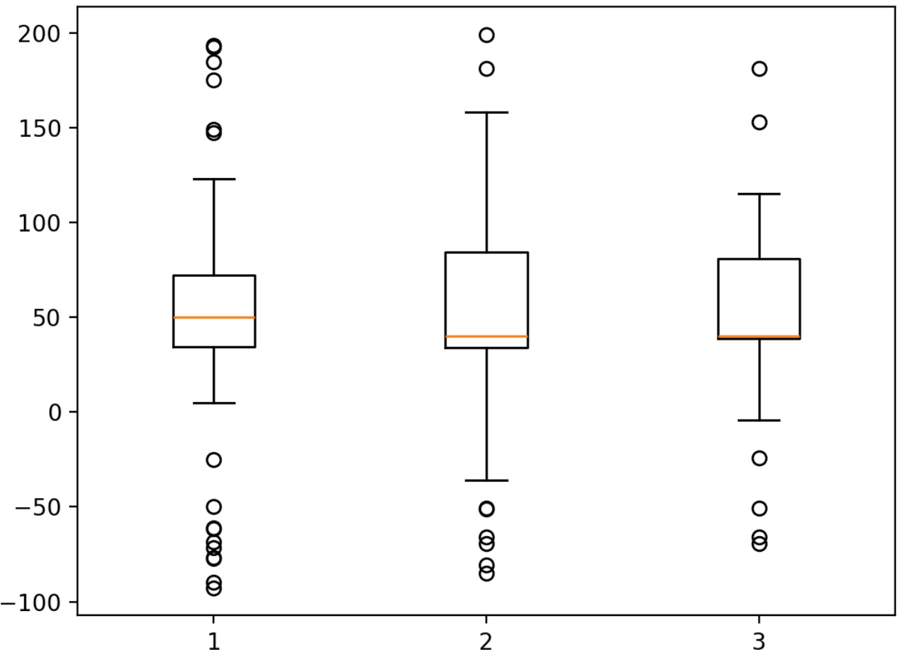

箱型圖（Boxplot）

原理：展示數據的中位數、四分位數（Q1、Q3）、鬚（whiskers）和離群值（超出 $ 1.5\times IQR $的點），反映分佈的集中趨勢和變異性。

適用情境：比較多組數據的分佈差異，例如不同地區的銷售額或產品類別的評分。

優勢：直觀展示異常值和分佈差異，適合多組比較；對數據量要求低。

缺點：無法顯示分佈形狀（如多峰）；對異常值敏感。（可延伸參考小提琴圖（Violin plot））