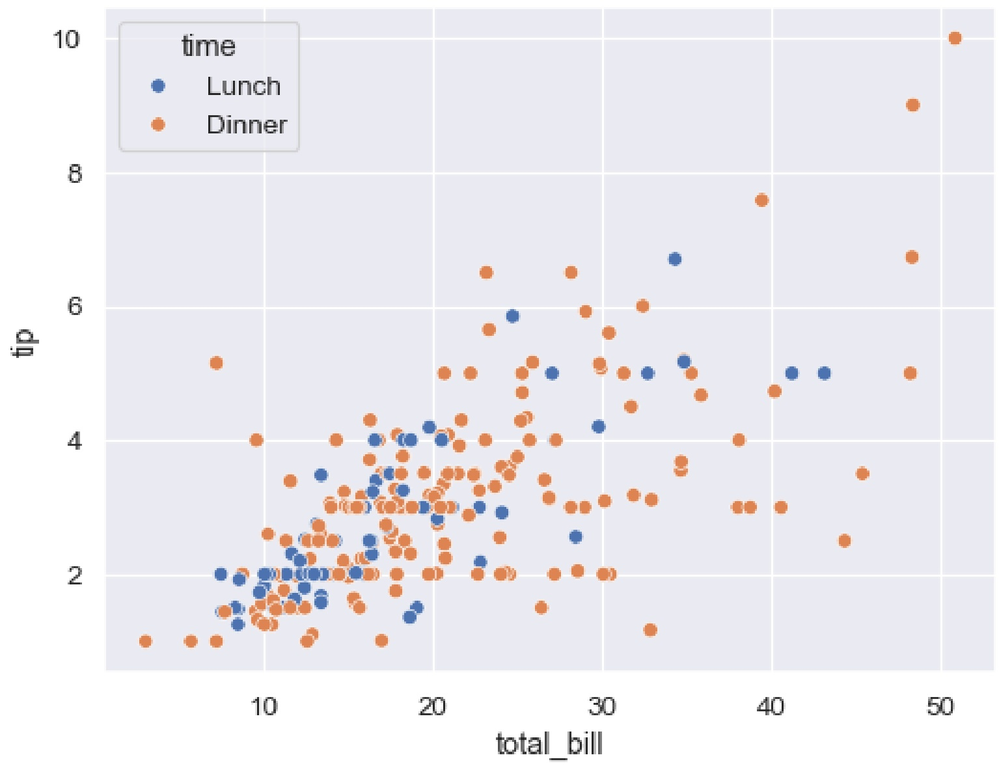

## （2） 變數之間的關聯與結構視覺化

關聯性視覺化專注於探索兩個或多個變數間的關係、群聚或線性趨勢，幫助識別潛在模式或共線性。

散佈圖（Scatter Plot）

原理：以二維座標展示兩個變數的分佈，點的位置反映變數值，搭配趨勢線可顯示線性關係。

適用情境：分析價格與銷售量、廣告花費與轉換率的關聯性，或識別群聚和異常值。

◆ 優勢：直觀展示相關性和異常點，適合探索性分析。

♦ 缺點：對高維數據無效；點過多時可能重疊，需透明度或分群處理。