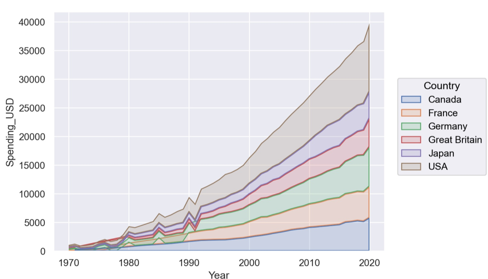

## （4） 時間序列資料的趨勢與變化

時間序列視覺化專注於展示數據隨時間的趨勢、週期性或事件影響，幫助分析動態變化。

折線圖（Line Chart）

原理：以連續線條表示時間點的數值變化，展示趨勢或週期。

◆ 優勢：清晰展示時間趨勢，適合連續數據。

適用情境：日銷售額、網站活躍用戶數、股票價格變化。

♦ 缺點：多條線重疊時難以辨識，需限制線條數量或使用交互式工具。

### 3. 主流數據視覺化平台與工具類型

在大數據環境中，視覺化工具不僅需提供豐富的圖表類型和設計能力，還需應對資料規模龐大、更新頻繁、來源多樣以及使用者多層角色（從分析師到管理者）的挑戰。視覺化解決方案需滿足探索性分析、決策報表生成和即時監控等需求，確保數據洞察直觀且可靠。本小節從「平台部署模式」和「呈現方式」兩個維度介紹主流數據視覺化工具，結合實務選型建議，幫助使用者選擇合適平台並避免資料失焦、顯著性膨脹等大數據挑戰。