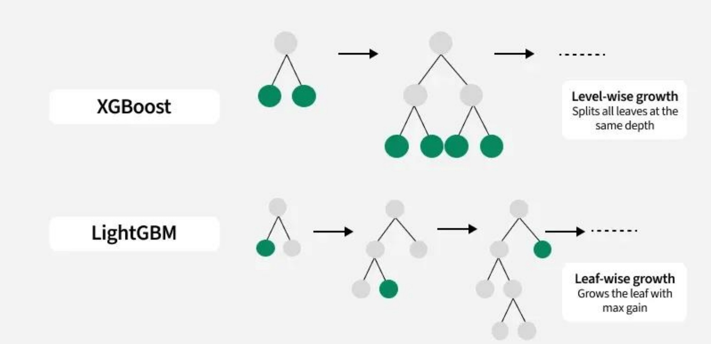

(Source: https://www.geeksforgeeks.org/)

## ♦ XGBoost (eXtreme Gradient Boosting)

強調運算效率與正則化，採用二階導數資訊（Hessian）來加速最佳分裂點搜尋，支援稀疏資料結構、缺失值自動處理，並內建防止過擬合的機制。

採用「層級式生長」Level-wise 策略。

在同一深度上同時分裂所有葉子節點。

■ 這意味著樹會橫向地擴展，每次增加一層深度時，所有當前葉子節點都會被考慮分裂。

♦ LightGBM (Light Gradient Boosting Machine)

LightGBM 採用「葉子式生長」Leaf-wise 分裂策略，而非如 XGBoost 採用的 Level-wise 分裂策略，讓演算法在更少計算下達到更好的效果。對於大數據、大特徵數的問題尤其高效，且在記憶體使用上更省。

■ 優先分裂能帶來最大增益（max gain）的葉子節點，這導致樹會垂直地生長，形成更深但不一定均勻的樹結構。

■ 相較於 XGBoost，LightGBM 的葉子式生長策略通常能更快地達到更高的準確度，同時在速度上更具優勢。