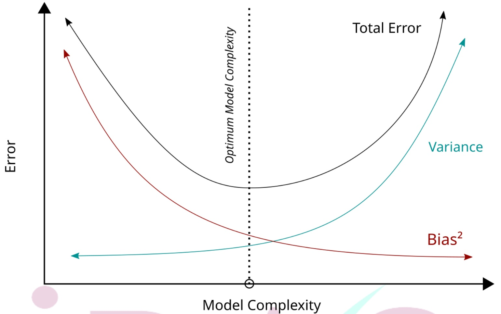

## （5） 偏差-變異的權衡（Bias-Variance Tradeoff）

模型選擇的核心原則之一是權衡偏差（bias）與變異（variance），兩者之間存在固有的取捨關係：

偏差（Bias）：

指模型對資料結構的擬合能力不足，無法有效捕捉資料中的主要趨勢，導致系統性誤差偏高（欠擬合）。

• 變異（Variance）：

指模型對訓練資料的細微差異或雜訊過於敏感，導致模型在不同資料集上的表現差異大、泛化能力差（過擬合）。

模型複雜度的提升通常伴隨偏差的降低與變異的提高，因此模型選擇應在二者之間取得適當平衡：

低複雜度模型（如線性迴歸）：

偏差較高、變異較低，穩定且具解釋性，但無法處理複雜關係。

高複雜度模型（如深度神經網路）：

偏差低、變異高，可擬合複雜模式，但需更多資料或額外的正則化方法以控制變異。