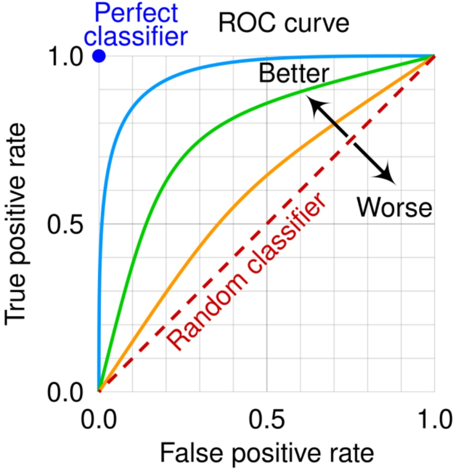

ROC 曲線與 AUC

ROC 曲線（Receiver Operating Characteristic）：

橫軸：假正率。

■縱軸：真正率畫出的曲線。

■ AUC（Area Under Curve）：表示曲線下的面積。

◆ 意義：

代表模型在所有可能閾值下的整體區分能力。

■ AUC 值越接近 1，模型越好。

◆ 適用：需綜觀整體預測能力時，特別是需調整分類閾值的應用。

## （2） 迴歸任務的評估指標

迴歸任務的目標為預測連續變數，模型評估需著重於預測值與實際值之間誤差的大小、穩定性與擬合程度。以下為常見指標及其特性說明：

均方誤差（Mean Squared Error, MSE）

◆ 公式：MSE =  $ \frac{1}{n}\sum_{i=1}^{n}(y_i - \hat{y}_i)^2 $

 $ y_{i} $: 為實際值