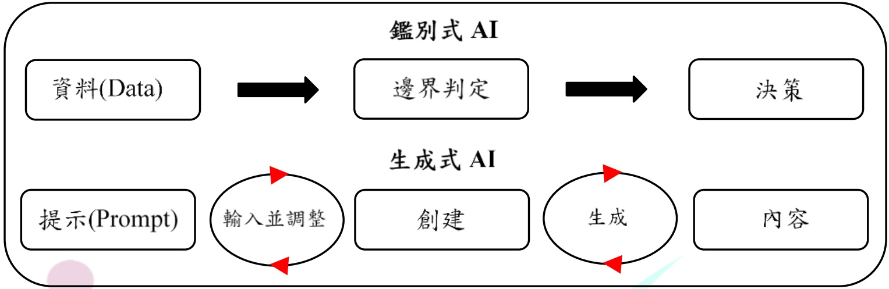

兩者的關鍵差異在於數據的角色與目標：

● 生成式 AI：利用龐大的訓練數據生成多樣化內容。

鑑別式 AI：基於數據分析進行分類與決策。

這種差異使生成式 AI 在創新內容生成上表現出色，而鑑別式 AI 則在精準分析與決策支持方面具有優勢。

隨著應用場景的日益複雜，鑑別式 AI 與生成式 AI 的整合成為突破技術瓶頸的重要途徑。兩者的協同應用可實現數據增強、模型泛化能力提升以及多模態融合等技術優勢，特別是在醫療、交通和教育等領域具有顯著價值。

### 1. 鑑別式 AI 與生成式 AI 的基本原理

## （1） 鑑別式 AI 的原理與應用

鑑別式 AI 是一種透過學習數據特徵與目標標記之間的條件概率 P(y|x)來進行預測的機器學習方法。其核心思想在於區分不同類別之間的差異，從而找到最適合分類或迴歸的邊界。鑑別式 AI 不會建構數據生成的內在機制，而是專注於判斷輸入數據所屬的類別或進行數值預測。這使得其在標記數據充足且任務目標明確的場景下，具有極高的準確性和計算效率。

透過直接建構條件分佈，鑑別式 AI 在分類、迴歸、模式識別等任務中有著重要的應用價值，如醫學影像分類、信用風險評估、語音辨識以及文本分類等領域。這類模型透過嚴謹的數學公式與優化過程，得以廣泛應用於不同領域，並且具有良好的解釋性與泛化能力。常見模型與技術如下：