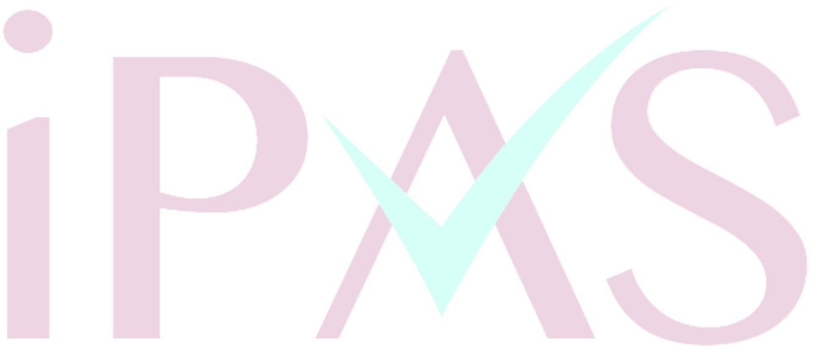

重要措施。這樣做可以避免抄襲，尊重原作者的知識產權，並提供內容的可靠性和可追溯性。直接使用生成的內容進行學術報告（選項 A）可能會導致學術不端行為，而減少人工參與的審查過程（選項 C）則可能降低內容的準確性和品質。完全排除所有生成的資料（選項 D）則過於極端，無法充分利用 AI 技術的優勢。因此，適當標注引用來源是最佳選擇。

### 9. $ \underline{\text{Ans (D)}} $

 $ \underline{\text{解析}} $:生成式 AI 工具在使用體驗方面的優化方向包括提供更直觀的操作設計、支援自然語言指令以及提供智慧化的參數調整建議，而不是限制使用者自訂生成內容。

