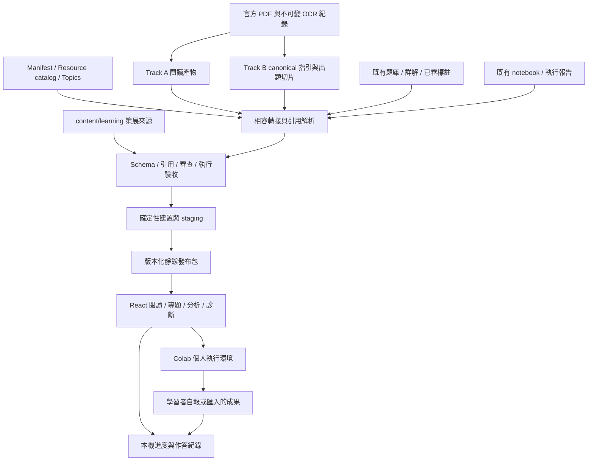

# 平台架構規格

狀態：本文件是目標架構規格；實際 MVP 完成與驗收範圍見 [progress.md](progress.md)，操作方式見 [mvp-runbook.md](mvp-runbook.md)。欄位契約見 [data-contracts.md](data-contracts.md)。

## 1. 邊界、使用者與首要設計

平台服務自行備考與希望將知識用在實務的學習者；內容維護者在 repository 編輯、審查、驗收與發布。
首要流程是從可信的指引段落出發，透過案例理解選擇理由，再用問題與實驗驗證學習成果。
「專題」須有真實情境、限制、可交付成果及評分規準；只有文章清單的是「學習路徑」。
「歷屆分析」描述已收錄題庫的分布；「模擬」依公開配置組成練習；兩者均不代表預測正式考試。

採 **static-first modular monolith**：同一 repository 中維護 Python 內容建置模組及 React 功能模組，產出靜態發布包。
這裡的模組化是資料所有權、介面及依賴明確；不是先拆多個服務或部署單元。
MVP 不需要運作中的 API、資料庫、任務佇列或向量資料庫，模型也不在瀏覽器或正式發布 CI 中呼叫。
後續帳號與同步需求出現時，以 repository interface 接上 API；不將資料庫模型提前混入 authored content。



## 2. 保留的既有架構與所有權

| 資料／能力 | 現行所有者 | 擴充規則 |
|---|---|---|
| 章節／科目定義 | `build_manifest.py` → 各等級 `toc_manifest.json` | 新內容只存引用，顯示標題由 manifest 解析 |
| 等級、官方／樣題考卷及參考資源 | `data/resource_catalog.json` | 擴充現有 schema 與讀取器，不另建考卷或外部來源常數表 |
| 概念詞彙 | `data/topics/topics.json` | 現有 name 作 key；先用版本化 TopicRef，stable ID 後續在原檔演進 |
| 原始 OCR 記錄 | `data/{level}/guide_ocr/` | 不得為實務改寫內容；既有校正層仍依 playbook |
| 指引閱讀 Track A | `guideContent`、`guideOutlines`、reading assets | 新入口引用，保持來源頁、公式、階層及 overlays 的 gate |
| 出題來源 Track B | canonical `subjectN_guide.json`、`guide_sections` | 與 Track A 不互相覆寫，保留內容 SHA 及 corrections |
| 章節文章 | `export_learning_articles.py` → `learningArticles` | 原稿閱讀視圖保留；不是實務補充的 authoring source |
| 章節題、官方題與詳解 | 既有 questions／reference pipeline | 題文保留，由 QuestionRef adapter 引用；新審核是獨立紀錄 |
| Colab | `notebooks/{level}/` 及現行 metadata exporter | 既有入口保留；新 labs 經新契約與更完整驗收接入 |

既有 UI 的 `/guide`、`/articles`、`/practice`、`/exam`、`/mindmap`、`/concepts` 不因新增模組而停用。
已有 6 條文章路徑目前由 `LEARNING_PATH_DEFINITIONS` 定義；遷移時移至 `content/learning/paths/`，
同一來源同時輸出舊 LearningPath shape 與新步驟式投影，移除舊常數後才算遷移完成。

## 3. 模組與責任

| 模組 | 責任 | 不擁有的資料 |
|---|---|---|
| Source / Identity | 解析 canonical references、SHA、別名與遷移映射 | 章節／題目／概念原始定義 |
| Learning Content | LearningUnit、案例、誤解、來源與延伸閱讀 | 指引原文及考試答案鍵 |
| Project / Path | 有成果的專題與有序學習步驟、先備要求 | 被引用的文章／單元／題目本文 |
| Lab | lab metadata、notebook 發布、執行報告與 rubric | 使用者 Colab 帳號及 runtime |
| Assessment | pool、blueprint、確定性選題、attempt、回饋 | 官方題原稿及使用者身分認證 |
| Exam Analysis | 已發布題與標註的統計投影、coverage | 新的概念詞彙表、猜測的未收錄考題 |
| Publication | schema、cross-ref、review gate、staging 與發布清單 | 編輯決策與 notebook 程式執行的正確性判定 |
| Learner State | 本機進度、作答版本、匯入／匯出 | 官方認證或可信的外部 lab 成績 |

Python 新增可共用的 `scripts/learning/` package，CLI wrappers 留在 `scripts/`；先切 validator、resolver、exporter 的依賴。
避免一開始重構所有舊腳本；現有讀取器由 adapters 呼叫，新模組不得反向成為 OCR 的必要依賴。
React 新增 `features/learning`、`features/projects`、`features/labs`、`features/analysis`、`features/simulation`；
沿用共用 ReadingContent、錯誤邊界、導覽、圖片 URL helper 與題目顯示元件，不複製一套 App shell。
P2 的內容批產沿用既有 CLI／API adapter，不硬綁供應商或模型版本；authoring run manifest 記錄 source revision、
promptVersion、model/config、schemaVersion、budget cap、逐 item input hash 與輸出狀態。
infra retry（逾時／空回）與 semantic revision（內容或答案有誤）分開，重跑只處理未完成 items；同一 hash 已通過的輸出不重付費生成。
費用上限、輸出缺件或 schema 錯誤使該 run 暫停，缺回覆不得記成 pass；候選及 logs 不直接進 publication index。

## 4. Authoring、建置與發布資料

```text
content/learning/                    # 新的版控策展來源
  units/                            # metadata JSON + Markdown body
  projects/                         # 成果、限制、rubric、步驟引用
  paths/                            # 閱讀／操作序列唯一來源
  labs/                             # LabSpec；不保存第二份 notebook 程式碼
  mock-blueprints/                  # 主題診斷／模擬卷配置
  mappings/                        # 已審題目／來源／學習單元關聯
  identity/                        # 引用別名與來源定位映射
  evidence/                        # 可追溯的事實與實驗證據
  analysis-policies/               # 統計口徑與覆蓋率政策
  reviews/                         # 綁定內容版本的審查決定
notebooks/labs/                     # 新 lab 的單一 notebook 編輯來源
frontend/src/generated/learning/    # current.json 指標 + releases/<releaseId>/ 不可變分片
frontend/public/labs/               # 按 lab ID／revision 產生下載檔
scripts/learning/                   # 純資料模組，不連線呼叫模型
schemas/learning/                   # JSON Schema；需由工作包建立
tests/fixtures/learning/            # 小型正常／失敗 fixture
```

以上路徑是目標；本次僅建立規格文件。詳細檔名、ID 及欄位以資料契約為準。
現行 canonical 及 committed 前端資料是 compatibility input；不要求開發者先重建 gitignored OCR cache 才能開發新功能。
Authoring source、身份映射、審核紀錄、必要執行摘要及發布所需新產物納入版控；大型 logs、暫存與執行 cache 不納入。
generated JSON 只能由指定 exporter 寫入；刻意策展先改 source，再生成輸出，不手改前端投影。

新 exporter 執行順序固定：讀 source snapshot → schema → 引用解析 → 審核與內容 gate → temporary staging →
生成 per-entity 分片及瘦索引 → 完整性檢查 → 寫入不可變 `releases/<releaseId>/` 與 `public/labs/<labId>/<revision>/` → 原子替換 current.json 指標。
兩個目的樹不宣稱同時 rename；先完成所有不可變資產、驗 manifest hash，再以單一指標啟用。相同版本路徑若已有不同bytes必須失敗，不能覆寫。
current.json temporary file 必須與指標同一 filesystem；替換失敗保留舊指標，未引用的新資產可留待後續清理。
第一版只做完整 learning bundle export；不刪其他等級或舊release資產。後續partial export／GC須先有跨等級、引用及rollback測試。
不得在新 exporter 內呼叫帶 `--force` 的 OCR 重建或改動既有 canonical 來源。

release metadata 包含 schema version、release ID、輸入 hash、實體 revisions、必需資產及 gate 結果。
release ID 由已正規化內容與依賴摘要產生，排除執行時間；同一 source 必須輸出相同內容 bytes。
前端索引、內容分片、分析、題池與 lab metadata 均引用同一 release manifest；build 拒絕混合 release ID 或檔案 hash 不符。
versioned notebook 先生成並提交，再由站台 build 注入包含該 notebook 的 Git commit URL；不把 commit 寫回 notebook 自我雜湊。
時間及環境診斷留在 build report，避免無意義的整包 diff。
外部網址無法保證永久不變，保存引用時間及最少必要的可追溯資訊；授權與重分發規則見內容規格。

## 5. 引用、版本與審查

LearningUnit、Project、Lab 各有不可重用的 ID 與獨立 revision；改內容產生新 contentHash，不靠檔名或標題辨識版本。
單元由章節、topic、來源區塊、題目、lab 等引用組合；關聯索引由 source 生成，不能成為第二份人工清冊。
原稿說明、實務延伸、版本較新的工具說明在閱讀頁中有可見標示；來源引文可返回精確頁面。
補充中的技術主張須有來源或可重現實驗；考題對照不能把相似概念敘述成官方答案的直接證據。

現行 GuideBlock `b1` 等序號可能在重匯出後改變。GuideRef 除 locator 必須綁定 guide／chapter／source SHA／頁面或區塊 fingerprint。
新 identity registry 只記錄 stable anchor 與來源定位，不複製 guide 原文。
重建時先比來源 hash，再依已確認映射解析；來源改版或多個候選匹配須產出 unresolved 並阻擋受影響的新內容發布。
不得把同樣的 `b12` 自動接到新版第十二塊；修復需新 revision、人工確認定位與重新審查。

TopicRef MVP 使用 canonical name 加 vocabularyHash；詞彙改名／合併透過明確 alias 與人工決定遷移。
後續在既有 `topics.json` 增加 stable ID，保留 name adapter，並更新所有 merge／標註／前端消費者後再切換。
QuestionRef 使用來源命名空間，官方卷 sourceKey 取 resource catalog key，章節題取來源檔 stem；legacy ID 不能跨題庫直接拼接使用。
同一題目內容變更但 ID 不變時，revision/hash 使舊 attempt 保持原始題快照，不能用新答案默默重算。

狀態機與字段以契約為準；總原則是草稿、審核完成、發布可用及來源過期分開表達。
發布 gate 驗 review 對應的 entity revision、contentHash 及 dependency hashes；舊 review 不能覆蓋新版本。
模型產出與模型共識都只是候選；高風險主張、答案爭議或 notebook 執行失敗需要維護者決定。
Legacy 是否已有審核逐筆讀現有證據：未映射的新內容先是 legacy/unreviewed，不能因曾上線而默認通過新 gate。
新 curated 體驗只使用 gate 通過的集合；既有頁面維持既有品質機制及 URL，逐步遷移，不整站無證據降級或升級。

## 6. 前端路由與載入

保留 HashRouter；文件中的 `/path` 指 hash 內路徑，部署到專案子路徑時仍用現有 base／asset helper。

| 路由 | 用途 | 顯示與行為 |
|---|---|---|
| `/guide/:subjectId/:chapterId` | 既有指引閱讀 | 顯示「實務補充」入口；回跳原章及 anchor |
| `/articles`、`/articles/:articleId` | 既有文章閱讀 | 保留既有路徑及內容；關聯新單元與專題 |
| `/learn`、`/learn/:unitId` | 補充清單／詳頁 | 概念、情境、決策、反例、來源、自我檢查及下一步 |
| `/projects`、`/projects/:projectId` | 專題清單／詳頁 | 先備、時間、步驟、交付成果、rubric、完成狀態 |
| `/paths/:pathId` | 混合學習路徑 | 由唯一 path source 輸出步驟；舊文章 path query 保持有效 |
| `/labs/:labId` | lab 說明頁 | 環境、資料、starter、solution、最後驗證資訊、Colab 入口 |
| `/analysis/exams` | 歷屆題分析 | 等級、科目、考卷、概念篩選；題數／分母／覆蓋率與 drill-down |
| `/simulations/:blueprintId` | 主題診斷／模擬 | 配置簡介、作答、計分、弱點回到補充及 lab |
| `/practice/...`、`/exam/:examKey` | 既有作答 | 原有行為維持；共用元件的改造必須通過既有 E2E |

列表只載入瘦索引；進詳頁才載 unit body、來源題、notebook 預覽或分析分片。
不得把全題庫、全部 notebook 或整個概念圖加入首頁 bundle。
module loader 只快取成功內容；網路錯誤有重試，未知 ID 與載入失敗分開顯示。
草稿與不合格新內容在 publication index 中不存在，直接開啟 URL 回應清楚的不可用狀態。
新 routes 加入桌面及行動 sidebar；保留鍵盤焦點、返回位置、適量動態效果、語意標題與表格替代圖表。
設計目標，尚非實測結果：首頁新增 learning 索引 gzip ≤ 50 KB；單頁 body JSON ≤ 250 KB 未壓縮，超出則分節載入。
PR 以現有 baseline 加差值報告驗證，首次實作若無法達成須提供測量及變更理由，不能默默擴大全域 imports。

## 7. 歷屆分析與模擬邊界

分析取已發佈 official／sample 題與已確認標註；兩種考卷分開顯示，生成練習題不混進歷屆頻率。
每個統計附 corpus snapshot、考卷清單、收錄題數、可標註題數、未標註題數及分類版本。
多標籤題在每個概念的題數採 unique QuestionRef；跨概念合計不等於總題數，UI 明示不可相加。
排序只解釋已收錄資料；未收錄年份或未審標註顯示未知，不能呈現為零。
沒有學習者群體作答資料時，禁止把編輯估計難度當成實測難度、鑑別度或通過率。

MVP 的 10 題是主題診斷，來源為已審核練習題；官方題只做獨立的對照案例與歷屆重練。
Blueprint 指定內容範圍、pool snapshot、題數、配額、時間與 seed；抽樣演算法及不足處理以契約為準。
題池不足必須列出缺口並停止組卷，不重複抽題、不偷換難度、不由前端臨時生成。
複合題／共享情境作為不可拆分 group；配額無可行解時返回診斷。MVP fixture 可先只用獨立單選題。
作答狀態使用 canonical QuestionRef 而非陣列位置；attempt 保存題序、選項序、版本與答案快照。
答案在靜態資產內可被查看，定位是自主練習；正式監考與保密考試不在這個架構保證範圍。

## 8. 學習紀錄、Colab 與持久性

MVP 提供 `LearnerRepository` 介面與 IndexedDB implementation，以原子 transaction 保存完整 attempt 快照。
介面至少提供 `getAttempt`、`saveAttempt`、`submitAttempt`、`listProgress`、`upsertProgress`、`exportData`、`importData` 與 `clearData`；詳細資料型別依契約。
只存進度與必要的題文／選項／答案版本快照，不存 notebook 大型輸出、資料集、密鑰或完整官方 PDF。
records 帶 schemaVersion、revision/hash、updatedAt 及完成證據類型；點擊 Colab 只記 opened。
MVP lab 只採自報完成，明確標示自評；P2 可選新增本機 lab report 匯入，仍是未經平台驗證，不能變成可信 passed。
同一 repository 介面提供 JSON 匯出、預覽後匯入與清除；匯入做大小／schema 限制，不執行 notebook 或 HTML。
儲存被拒絕或額度不足時退回記憶體狀態並提示無法保存，作答與閱讀仍可進行。
紀錄保留上限、衝突與過期規則見資料契約；跨分頁寫入採 transaction 與修訂衝突檢查，不整份狀態覆蓋。

既有 PracticePage 的 localStorage key 保留；首次遷移驗證來源及題 ID 後複製到新格式，保留原備份。
既有 ExamStore 是記憶體狀態；不要宣稱已有重新整理回復。新 simulation attempt 才加入版本化續答。
續答以絕對 deadline 計時，重新載入立即補正；逾時交卷，避免 tab 暫停延長時間。
題庫版本消失或 hash 不符時只允許查看已存摘要／重開新測驗，不將答案套到目前題目。
資料僅存在該瀏覽器／網站 origin；無帳號同步。未來 API 同步須先處理 consent、刪除、匯入衝突與離線相容。

Colab 以 versioned notebook URL 開啟；平台不接受其任意 webhook、不持有 Colab runtime，也不要求 Google token。
LabSpec、notebook source、starter／solution 與驗證報告版本一致；環境、免費 CPU 路徑及執行成本對學習者可見。
Notebook 執行隔離、依賴鎖定、資料授權、自動檢查及人工驗收詳見內容規格。

## 9. 測試、部署與回復

測試分成契約／純函式、真實小內容 fixture、瀏覽器流程、notebook 執行四層；不以 JSON 能 parse 取代語意驗收。
維持 `tests/run_all.py` 所列既有 13 項 gate；新增 gate 逐項接入，不能將 `--skip-browser` 當 release pass。
新資料或前端變更要 build；資料 pipeline 變更跑受影響等級 alignment；執行時行為及正式發佈跑完整 gate。
新內容 release gate 最少涵蓋 dangling refs、來源過期、未審發布、資料不足、作答錯位、note 執行與來源回跳。
現行 GitHub Actions quality → build → Pages deployment 依賴順序保留；正式 build 不讀 gitignored cache 或要求模型金鑰。
PR 階段不部署 main；本規劃不觸發任何部署。

前端新增 runtime feature flag 可關閉新入口且保留舊 routes；候選 release 先驗完整再切換。
失敗回復 current.json 至上一個完整不可變 release；pointer所引用的index／內容／lab全部綁定該manifest，不解析混合版本。舊revisions至少保留到相容遷移窗口結束，GC獨立執行。
canonical source 修改以 git revert 回復；gitignored cache 不作唯一復原來源。
使用者資料 migration 先備份、可重入、只向前寫新 key；程式 rollback 不刪新舊作答紀錄。
觀測先使用 CI JSON reports、失效引用報告、內容覆蓋矩陣與人工 issue；MVP 不收集遠端個人作答 telemetry。

## 10. 後續擴展觸發條件

| 實際需求／量測 | 下一步 | 仍需維持 |
|---|---|---|
| 索引或資產超出預算，build 體積及時間成瓶頸 | 增加分片／版本資產 CDN；沿用現有 `publicAsset()` 能力 | catalog、版本 URL、引用及 integrity gate |
| 題目多到 client 組卷明顯卡頓 | 預先建立 pool 分片，測量後用 worker；再評估 API | 確定性 seed、pool snapshot、計分一致 |
| 明確需要跨裝置／班級進度 | 增加帳號 API 與關聯式資料庫，替換 LearnerRepository adapter | 本機可用、匯出權、schema migration |
| 多位非工程編輯頻繁衝突 | 建立 authoring UI／工作流程服務 | 同一 source schema、review gate、Git 匯出能力 |
| 有實際付費、授權與角色管理需求 | 獨立商業及身分 ADR，再規劃後端部署 | 公開內容與受限資料邊界、既有 URL |
| 需要可信 lab 評分或監考 | 另設隔離執行與評分服務 | 不信任 client 宣告、不可把 Colab 點擊當驗收 |

不以「未來規模會大」作為提前導入微服務、Kubernetes、向量庫或完整 LMS 的理由。
本藍圖完成標準是 P1 可從一段指引一路走到實驗與診斷，且同一套契約可增加第二個專題；後續擴展由需求與量測決定。
